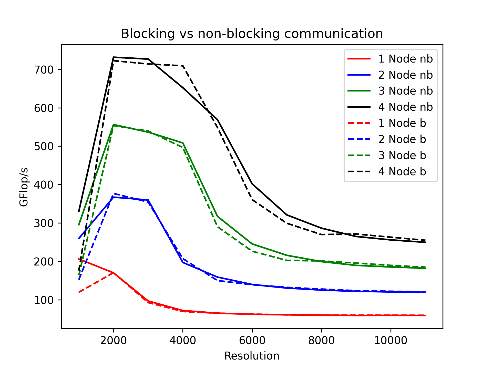
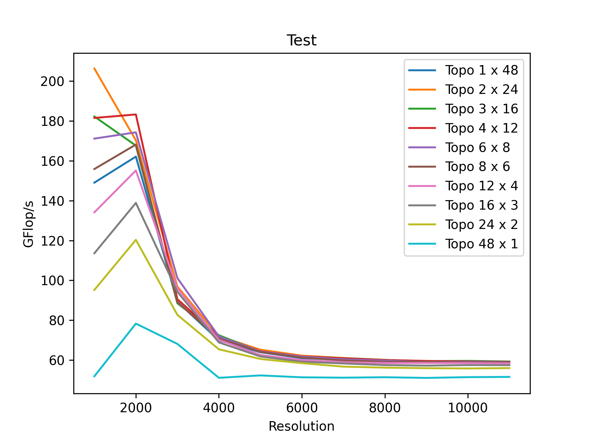
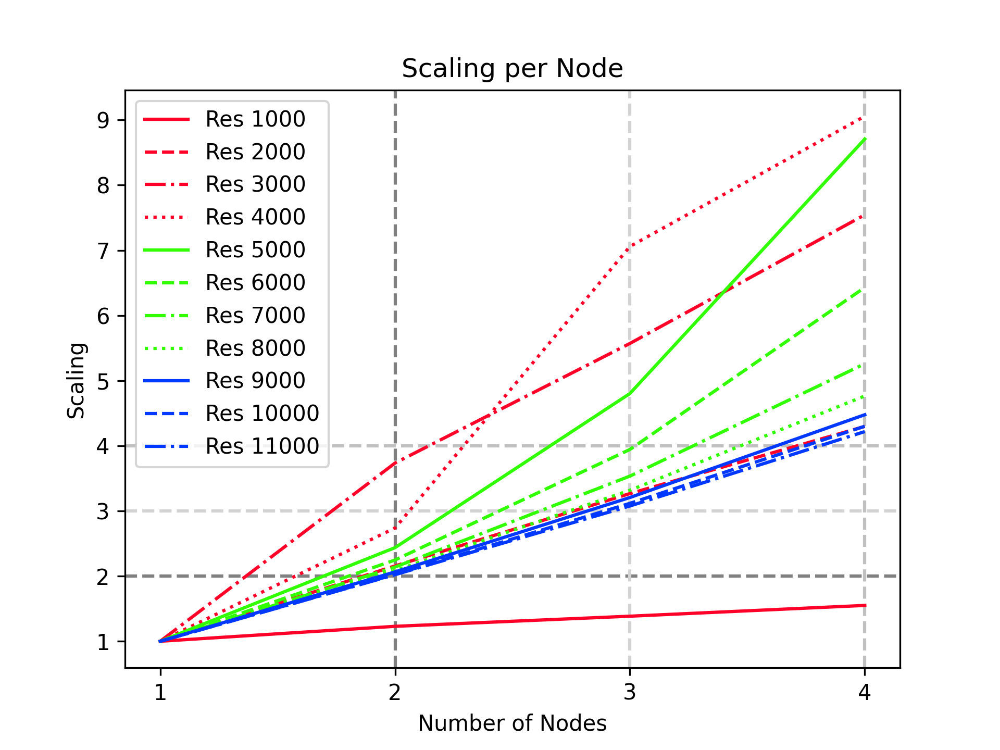
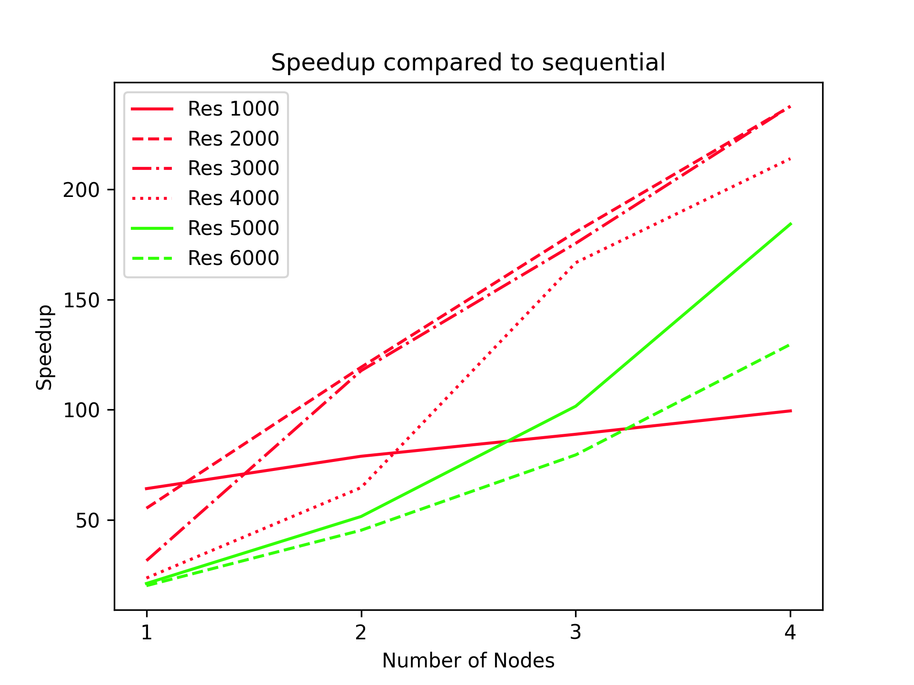
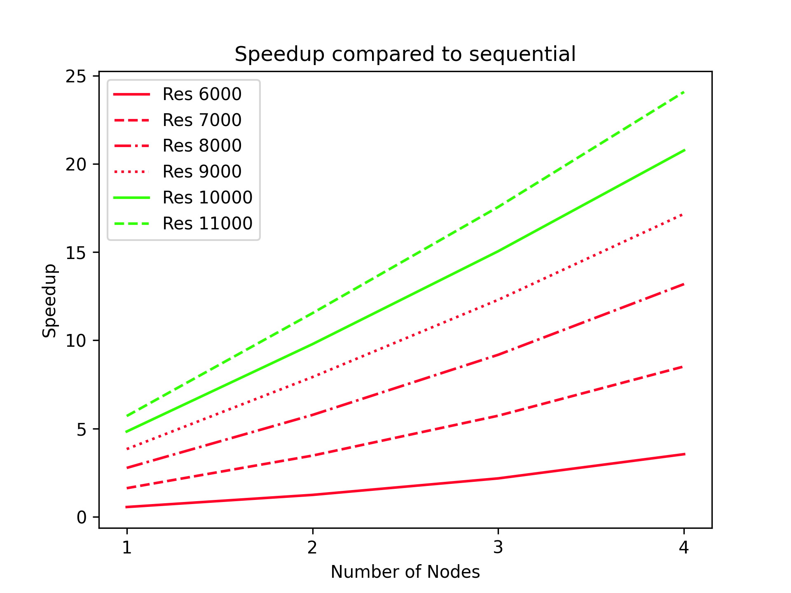
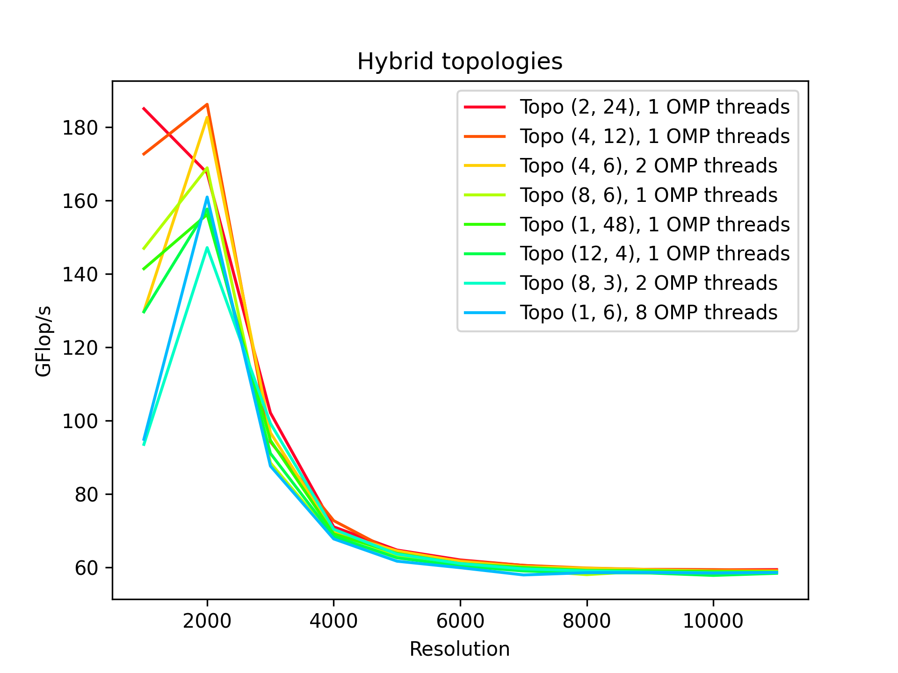
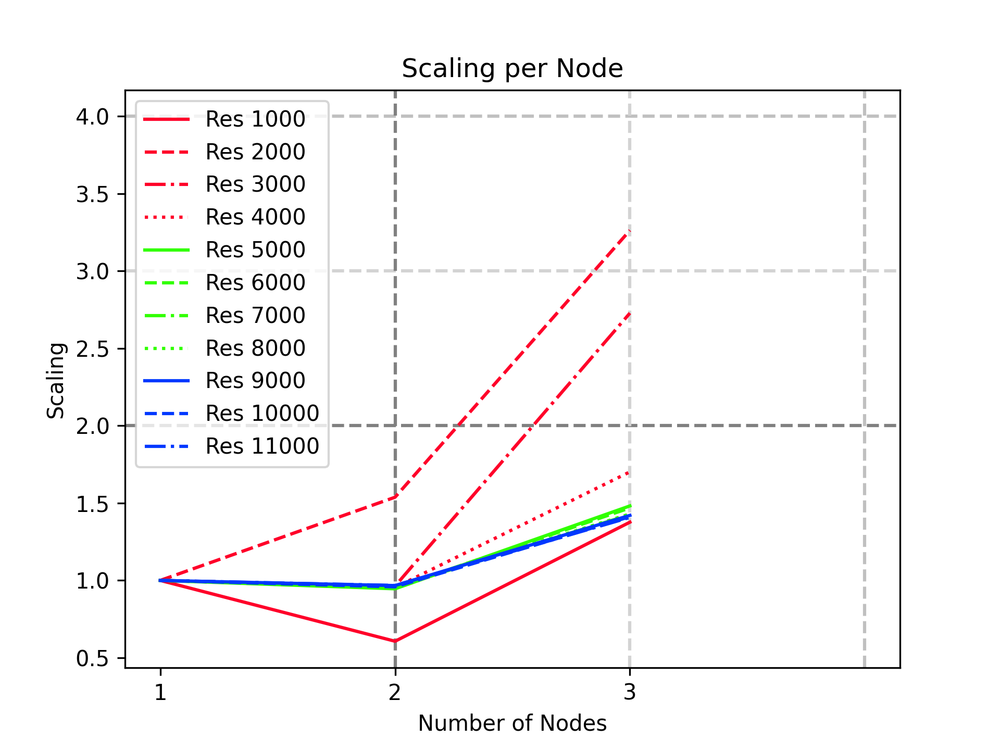

# Assignment 7

## MPI parallelization - Workflow

For this part of the assignment we continue working based on the works done of assignment 6, including following works:
- Splitting input data: each MPI process reads its own data from the input file, and creates a local `res` 2D-array.
- Each MPI process calculates relax_jacobi and residual locally, and exchange its boundaries after every iteration.
- The exchanging boundaries was done by Blocking and Non-blocking communication.
- Overlaping computation and Non-blocking communication.
- The residual results is sent and summed up at the master node.
- Coarsening results distributedly and gatherred at the master node.

We refer to tiles as blocks of the global grid each MPI process works on

All results shown are compiled with: ``std=c11 -O3 -xCORE-AVX512 -fno-alias -qopt-zmm-usage=high -funroll-all-loops``, which
we found in assignment 1 to be the fastest. For the hybrid version we also added the `-qopenmp` flag.

### Blocking vs non-blocking communication

##### Blocking communication 

The blocking communication was implemented using ``MPI_Sendrecv``. Each tile sends its non-ghost cell borders
to all neighbours. These are copied into the ghost cells of the neighbours.

Further, we introduced a `column_type` which represents a column for a block. This data type included strides and
therefore, makes it very easy to copy a column from one rank to another.
 
##### Non-Blocking communication 

The non-blocking communication is a little more involved. `MPI_Isend` and `MPI_irecv` routines are used for transfer.
The requests that are passed to each of these functions are stored in an array and waited for at some point.

Else the calls look very similar as to the blocking communication calls.
 
##### Computation while waiting 

For non-blocking communication, we can start computing while there is no data present from the neighbours.

We decided on a very simple mechanism. At the start of each iteration, we check if we have to wait for any requests.
If we don't have to wait for any, we just do a complete iteration of the Jacobi algorithm.

If there would be pending send and receives, we already start computing the Jacobi method for everything except the border.
In other words, we temporarily shrink the computation area by 1. After that we wait for all the pending send
and receives compute the borders using the now updated ghost cells.

After these steps we communicate the data and start over again.

##### Performance difference
 
{width=70%} 
 
In figure \ref{fig:comms}, we plotted the throughput for 1 to 4 nodes for non-blocking and blocking communication.
All non-blocking communication is shown with solid lines and blocking communication with dotted lines. 

Looking at the figures, especially for the resolution of 1000, the difference between blocking and non-blocking communication
is quite large. For 1 Node, the difference is very little overall. For 2 to 4 nodes, the difference is rather small.
Interestingly blocking communication is sometimes also faster than non-blocking communication, as it is with the black
lines.
 
##### Coarsen

Given coarsen functions was used. Besides, we also introduced a scaling factor to recalcualte the new resolution for the MPI processes that have less elements than usual processes (The MPI processes that lies on the last row and last column in virtual topology).

The results resolution then gatherred at the master node. We used `MPI_Type_create_subarray` to set up format of being received data at the master node. This functions help to place received data by 2D-blocks to the correct location in the global 2D array..

For the sending data. We used `MPI_Type_vector` to select data from the local resolution and pack it as a vector. 

`MPI_Gatherv` was used to gather resolution data from compute nodes to the master node.

Although the resulted picture is not probably correct, from our efforts of debugging the code, the extracting, packing, and gathering data worked correctly. Thus, the issue might arise from the coarsening function. We are continue working on it.

 
### Topology effects

We'll discuss the effects of the topology on 1 single node first, and then extend it to multiple nodes. 

On the Supermuc each node has 48 cores. Therefore we have 10 possible topology dimensions. These are:
$1 \times 48$, $2 \times 24$, $3 \times 16$, $4 \times 12$, $6 \times 8$, $8 \times 6$, $12 \times 5$, $3 \times 16$,
$24 \times 2$ and $48 \times 1$ (where the first is the splits in the x dimensions and the second coordinate the
number of splits in the y dimensions)
 
{width=70%} 

{width=70%}

Looking at Figure \ref{fig:topo_perf}, we can see that for smaller resolutions the topologie has a major effect on
the performance. $2 \times 24$ has the highest performance for a resolution of 1000, and $48 \times 1$ the worst.
For a resolution of 2000, $4 \times 12$ has now the highest. The further the resolution increases, the closer
all of the different topologies get. However, $48 \times 1$ stays the worst with some distance. $24 \times 2$ is also consistently
the second worst, thou the difference is smaller for larger resolutions.

The last observation from Figure \ref{fig:topo_perf}, is that all topologies expect $1 \times 48$ are faster for
the resolution of 2000, compared to 1000, but then drop performance significantly.

TODO: show speedup compared on sequential version

From here on, we picked the best one for each of the given number of nodes. In theory our code makes it possible to 
choose different optimal topologies depending on the given resolution, but to stick to the assignment specification we
did not do this.

We decided on choosing the topology based on averages over all resolutions. The best topologies from our testing are
summaries in the following table:

| Number of Nodes |      Topology |
|-----------------|---------------|
|               1 | $2 \times 24$ |
|               2 | $6 \times 16$ |
|               3 | $8 \times 18$ |
|               4 | $6 \times 32$ |
 
### Strong Scaling

In this scaling test, we compare 1, 2, 3 and 4 nodes against each other, all of them run the same code at the same
sizes, and only differ in their number of processors cores and topology (strong scaling)
 
{width=70%} 

Figure \ref{fig:speedup1} all resolutions are shown individually over all nodes. The dotted grey lines indicate rather
the scaling (compared to 1 Node) is higher or lower than a linear scaling. So if at a resolution the lines is beneath
the cross section, the scaling is worse, and linear.

The resolution of 2000 scales very close to linear for all nodes.

In the figure, we can see that a resolution of 1000 scales terribly. Even adding 4 nodes, it can't reach a 2x speedup.
For resolutions between r000 and 5000, we see high scaling. All of them are in the range of 7 to 9 times faster for 4
nodes compared to a single one. Also for 2 and 3 nodes they show faster than linear scaling.

Further increasing the resolution until 11000, they slowly get closer to linear scaling. With 6000 still showing
quite a bit larger scaling especially for 4 nodes. The resolutions 9000, 10000, and 11000 are very close to linear.
Add one node and double the performance. This is still great behaviour of the code.
 
#### Speeup compared to sequential version 
 
Comparing our MPI implementation with the original sequential version. The speedup are a mixed bag. They range from
very high speedups to pretty much useless and even slower.

{width=45%}\ {width=45%}

<!-- Include Latex to create caption for 3 images -->
\begin{figure}[!h]
\caption{Speedup compared to sequential version, left smaller resolutions, right larger resolutions}
\end{figure}

### Reference for all MPI calls used in this assignment
#### Data type

- `MPI_Datatype` - Define a (new) data type for MPI communication.
```
MPI_Datatype type_name
```

- `MPI_Type_vector` - Creates a vector (strided) datatype.
```
int MPI_Type_vector(int count, int blocklength, 
                    int stride, 
                    MPI_Datatype oldtype,
                    MPI_Datatype * newtype)
```

- `MPI_Type_create_subarray` - Creates a data type describing an n-dimensional subarray of an n-dimensional array.
```
int MPI_Type_create_subarray(int ndims,
                           const int array_of_sizes[],
                           const int array_of_subsizes[],
                           const int array_of_starts[],
                           int order,
                           MPI_Datatype oldtype, 
                           MPI_Datatype *newtype)
```
<!--- While `int ndims`: Number of array dimensions, `array_of_sizes`: Number of elements of type oldtype in each dimension of the full array, `array_of_subsizes`: Number of elements of type oldtype in each dimension of the subarray, `array_of_starts`: Starting coordinates of the subarray in each dimension, `order`: Array storage order flag, `oldtype`: Array element data type.>
--->

- `MPI_Type_create_resized` - Create a datatype with a new lower bound and extent from an existing datatype.
```
int MPI_Type_create_resized(MPI_Datatype oldtype,
                            MPI_Aint lb, 
                            MPI_Aint extent,
                            MPI_Datatype * newtype)
```


-  `MPI_Type_commit` - Commits the datatype.
```
int MPI_Type_commit(MPI_Datatype *datatype)
```

#### Communications
<!--
- `MPI_Barrier` - Blocks until all processes in the communicator have reached this routine.
```
int MPI_Barrier( MPI_Comm comm )
```
-->
- `MPI_Sendrecv` - Sends and receives a message in a blocking communication.
```
int MPI_Sendrecv(const void *sendbuf, int sendcount, 
                 MPI_Datatype sendtype,
                 int dest, int sendtag,
                 void *recvbuf, int recvcount, 
                 MPI_Datatype recvtype,
                 int source, int recvtag, 
                 MPI_Comm comm, 
                 MPI_Status * status)
```

- `MPI_Isend` - Begins a nonblocking send
```
int MPI_Isend(const void *buf, int count, 
              MPI_Datatype datatype, 
              int dest, int tag,
              MPI_Comm comm, 
              MPI_Request *request)
```

- `MPI_Irecv` - Begins a nonblocking receive
```
int MPI_Irecv(void *buf, int count, 
              MPI_Datatype datatype, 
              int source, int tag, 
              MPI_Comm comm, 
              MPI_Request * request)
```

- `MPI_Gatherv` - Gathers into specified locations from all processes in a group.
```
int MPI_Gatherv(const void *sendbuf, int sendcount, 
                MPI_Datatype sendtype,
                void *recvbuf, const int *recvcounts, 
                const int *displs,
                MPI_Datatype recvtype, 
                int root,
                MPI_Comm comm)
```
## Hybrid Parallelization with MPI and OpenMP

### Topology 
 
{width=70%} 

In Figure \ref{fig:hybrid_topo}, we show 8 different configurations for our hybrid setup using 1 node. We used
different numbers of threads assigned to each MPI process ranging from 1 to to 24 OpenMP threads. Looking 
at the results in Figure \ref{fig:hybrid_topo}, we see that in the top 8 (calculated as the average over all resolutions)
5 of 8 results use only a single OpenMP thread. 

We would have thought this to be counter intuitive. As using OpenMP threads, the communication overhead is lower,
and therefore we would have assumed this to be faster, than the MPI only version. Maybe this is a inefficiency in our
implementation, we are not sure.

As for 1 node the performance is so similar to the MPI only version, we will skip the discussion on speedup.

In the following table we see the best topologies with the best number of threads for it:

| Number of Nodes |      Topology | OpenMP threads |
|-----------------|---------------|----------------|
|               1 | $2 \times 24$ |              1 |
|               2 | $12 \times 8$ |              1 |
|               3 | $4 \times 36$ |              1 |

Again it's basically the MPI only version, which we find strange, but sadly don't have enought time to investigate.


{width=45%} 

Also in the speedup charts we see similar results. Scaling for some resolutions like 2000 and 3000 works good
But many don't really scale as well as the MPI only versions.
  
   
 
